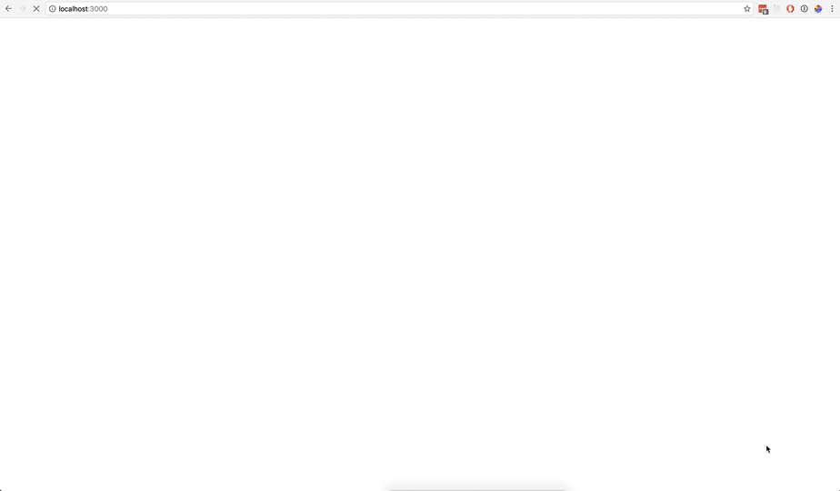

# Spec
## Acceptance Criteria
1. Must use the marvel API (https://developer.marvel.com/)
1. Primary language used must be JS
1. It must display a list of characters
1. Each character must link to their own details page
1. The layout must be responsive for desktop and mobile clients
1. Browser history must be maintained when navigating between views

## Considerations
When creating the app consider the following areas :
* Modern development practices
* Performance
* Scalability 
* Testability

# Setup
This has been tested with:
* `npm@3.10.8`
* `node@6.9.1`
* `yarn@0.18.1`
* Chrome @ Version 55.0.2883.95

## Setup steps:
In your terminal...
* Run `git clone https://github.com/patrickgordon/jumbo-marvel.git patrickgordon-jumbo-marvel`
* Run `cd patrickgordon-jumbo-marvel`
* Run `yarn install`
* Run `yarn start`

# Implementation comments
* I used `create-react-app` to get the ball rolling.
* Decided to roll my own CSS to keep things lightweight
* Redux added to ensure that the route structure can be upheld and when opening that route there is 
already hydrated data
* I added selectors to show how they can be used in a redux app. Not really that necessary but gave 
some neatness to the app and allowed me to remove a lot of ternary operators from the render of
`CharacterDetails`. Also speaks to the performance aspect of the spec due to reselect only recalculating
when the redux state that it is using changes not when the component re-renders.
* There is a bug with the pagination when returning from looking at a character it resets the page
to 1 despite being on a different page. One way to resolve this is by putting the pagination state 
in to the store - something like `state.ui.pagination` or similar. I just ran out of time.
* There is an issue where if you navigate to a different page, select a character, then refresh it 
will not have any details. One solution is to dispatch an action in `componentWillMount` or 
`componentDidMount` to fetch for a specific ID. I haven't implemented the appropriate actions etc.
yet.

# Comments on directory structure
The way I have set up the directory structure draws some inspiration from [this post](https://github.com/davezuko/react-redux-starter-kit/wiki/Fractal-Project-Structure)  

Below paths are relative to `src`

| Directory         | Purpose                                                                                                                               |
| ----------------- | ------------------------------------------------------------------------------------------------------------------------------------- |
| components        | Re-usable components. Presentational or "dumb". These are shared between smart components                                             |
| layout            | Components used to structure how the app looks at the higher level.                                                                   |
| redux             | Contains all the 'modules'  as well as the store creation and selectors. All redux related code goes here                             |
| routes            | This is where the router points to. The smart container component has no JSX and just connects the store to the components beneath it |
| routes/components | These receive props from the container which are from redux (state & actions)                                                         |

# Routes
|Route             |Component    |
|------------------|-------------|
|Index             |`Characters` |
|`/characters/:id` |`Character`  |

# User flow
1. Hit the Index route which renders the `App` component and it's child `CharactersList`. Upon app starting it has dispatched to API to get data.
1. `CharactersList` shows the data once it has completed fetching.
1. Clicking on a character link navigates to `/characters/:id` which will render the `CharacterDetails` component